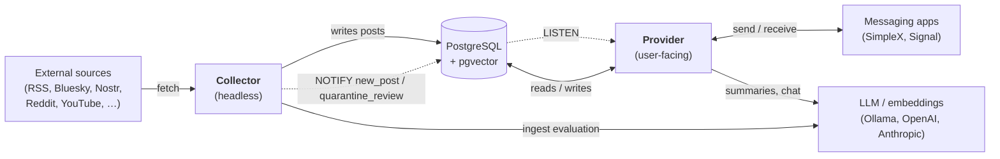
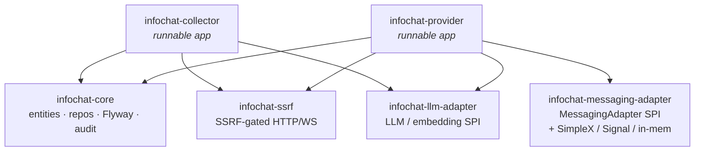
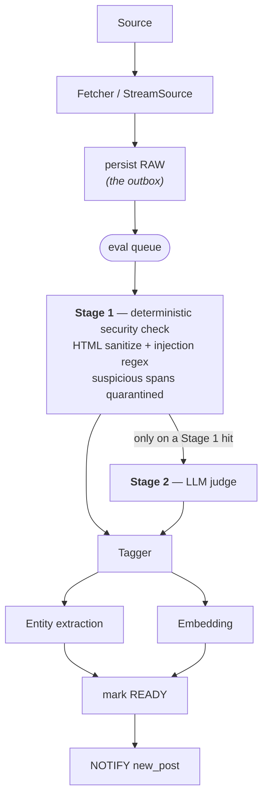
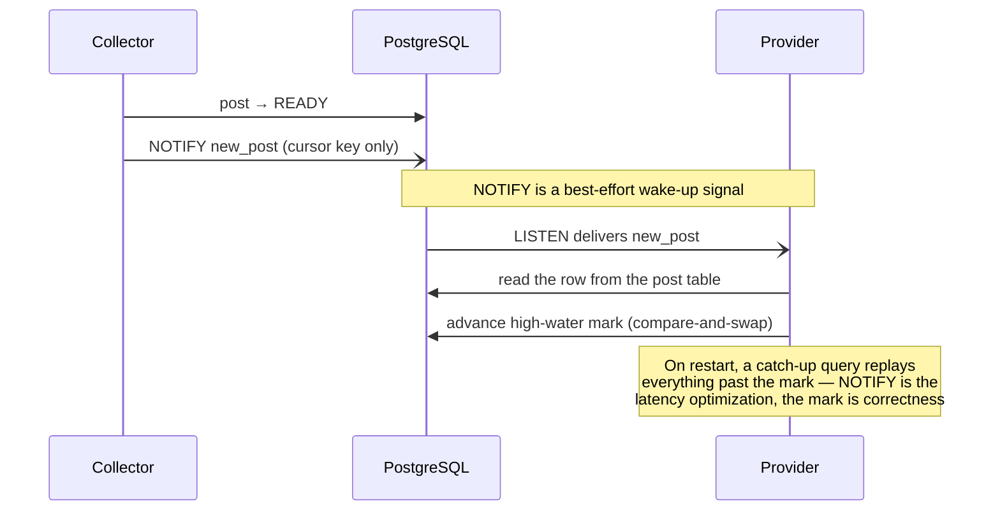
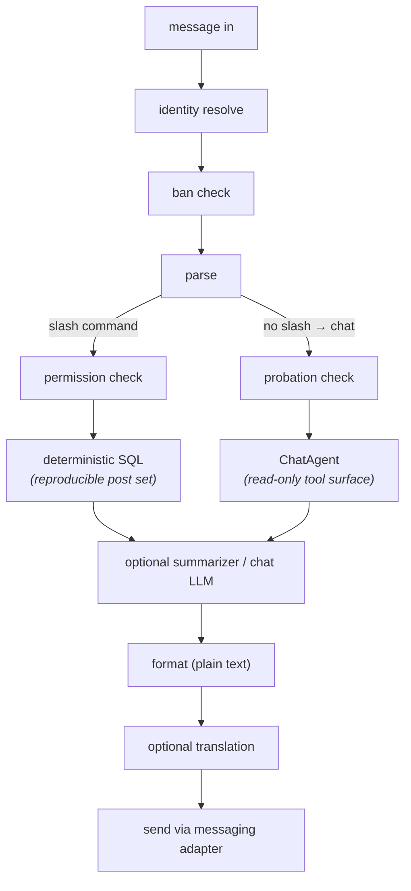

# infochat — Architecture Overview

> **The 5-minute mental model.** This document is the high-level map: what the
> system is, what the moving parts are, how they relate, and how data flows. It
> is intentionally thin — it carries *shape*, not implementation specifics, and
> links down to the spec and design notes for every detail. Read this first;
> follow a link when you need depth.
>
> Sibling docs: [README.md](README.md) is the *product* story (what it does for
> a user); [docs/SPEC.md](docs/SPEC.md) is the *detailed* technical map
> (reading order, glossary, full spec). This file sits between them.

---

## 1. What infochat is

infochat is a **self-hosted news and social-media aggregator chatbot**. It
fetches the feeds you care about (RSS, Bluesky, Nostr, Reddit, YouTube, Odysee,
Nitter), runs every post through an LLM evaluation pipeline (security check,
tagging, entity extraction, embedding), and serves it back to you on demand —
summaries, filtered lists, follow-up questions — inside a private messaging app
(SimpleX or Signal). You run it on your own hardware; your data stays there.

It is built as **two cooperating services** that share a single PostgreSQL
database and never talk to each other directly over the network.

→ Product detail: [README.md](README.md).

---

## 2. The big picture

- The **Collector** fetches sources, evaluates each post, and writes results to
  the database. It has **no user-facing API** — no user can address it.
- The **Provider** is the **only** thing users talk to. It owns the messaging
  adapters, the command router, and the chat agent.
- They communicate **only through the shared database**: the Collector writes
  posts and fires a Postgres `NOTIFY`; the Provider `LISTEN`s and reads the rows
  back. There is no broker and no direct RPC between the two.
- Both services call out to an **LLM**: the Collector for ingest evaluation, the
  Provider for summaries and chat.

→ Why the split, and the full inter-service contract:
[docs/spec/architecture.md](docs/spec/architecture.md) §Service split,
§Inter-service communication.

---

## 3. The two services

### Collector — headless ingest
- Fetches every source on a schedule (`Fetcher` for polled feeds; `StreamSource`
  for long-lived subscriptions like Nostr).
- Runs the LLM evaluation pipeline (§5.1) and persists posts.
- Fetches asset price snapshots on a separate path (§5.4).
- Fires `LISTEN/NOTIFY` events when posts become `READY` or need review.
- **No user-facing surface** — a compromised fetcher cannot reach a user.

### Provider — the only user-facing component
- Talks to the messaging apps via one or more pluggable adapters (any non-empty
  subset of SimpleX / Signal can run at once).
- Routes slash commands (deterministic SQL) and chat-mode messages (the chat
  agent, with a read-only tool surface).
- Owns all per-(user, scope) state: subscriptions, saves, memory, preferences.
- Runs the deterministic authorization layer (ban check, admin tiers) — **the
  LLM is never in the trust path**.
- Sends periodic group digests; reconciles missed `NOTIFY` events on restart.

→ [docs/spec/architecture.md](docs/spec/architecture.md) §Service split ·
[docs/spec/commands.md](docs/spec/commands.md) · [docs/spec/security.md](docs/spec/security.md).

---

## 4. The modules

Six Maven modules: two runnable services on top of four shared libraries.

| Module | Responsibilities | Used by |
|---|---|---|
| **infochat-core** | • Shared DTOs, Panache entities, repositories • Flyway database migrations (the schema lives here) • Audit logging, redaction/`SafeLog`, throttled admin notifier • Shared utilities and profile config | both services |
| **infochat-ssrf** | • The single SSRF-gated outbound HTTP/WS client • IP-range blocklist, DNS-rebind defense, redirect cap, scheme allowlist, body-size caps • Every outbound fetch in the system goes through it | Collector (feed/stream fetch), Provider (`/add-source` URL probe) |
| **infochat-llm-adapter** | • `LlmProvider` / `EmbeddingProvider` SPI • Task-based router (per-`ModelTask` model + config) • OpenAI-compatible and Anthropic implementations + startup guards | both services |
| **infochat-messaging-adapter** | • `MessagingAdapter` SPI (wire-anchored identity, capability flags) • `TranslationProvider`, `ProgressNotifier` SPIs • Concrete adapters: SimpleX, Signal, and an in-memory test adapter | **Provider only** |
| **infochat-collector** | • Schedulers and fetchers (RSS, Bluesky, Reddit, Nitter, YouTube, Odysee, Nostr) • The eval pipeline (Stage 1, Stage 2, tagger, entities, embeddings) • Outbox rehydrator, linking job, asset price fetch, `NOTIFY` emitters | runnable service |
| **infochat-provider** | • Messaging-adapter registry and inbound dispatch • Command router, chat agent, summarizer, group digests • User/group management, ban & admin guards • `NOTIFY` listeners + high-water-mark reconcilers | runnable service |

The Collector deliberately does **not** depend on `infochat-messaging-adapter`:
ingest code has no business holding a handle to a user-facing transport.

→ Package layout and file-level detail:
[docs/design/01-architecture.md](docs/design/01-architecture.md) §1.2.

---

## 5. How data flows — the loops

### 5.1 Ingest pipeline (Collector)

A post is fetched, persisted as `RAW`, then walked through evaluation stages
before it becomes visible to users.

- **Persist-before-enqueue is the outbox.** A startup rehydrator re-enqueues
  anything left in `RAW` after a crash — no work is lost.
- **Stage 1 is deterministic and always runs; Stage 2 (LLM) runs only on a
  Stage 1 hit.** The LLM is downstream of the security decision, never the gate.
- **Entity extraction and embedding run in parallel** after tagging; `READY`
  promotion waits for both.

→ [docs/spec/architecture.md](docs/spec/architecture.md) §Pipelines ·
[docs/spec/security.md](docs/spec/security.md) §Ingest pipeline ·
[docs/design/01-architecture.md](docs/design/01-architecture.md) §1.3.

### 5.2 Collector → Provider events (LISTEN/NOTIFY)

The only inter-service channel is the database. The closed v1 channel list is
`new_post` and `quarantine_review` (adding one is a spec amendment).

- The payload is **only the cursor key**, never the data — the receiver reads
  the row from its base table. `NOTIFY` is purely the wake-up.
- A **high-water mark** per channel guarantees correctness across restarts and
  makes processing idempotent (a duplicate `NOTIFY` produces no extra effect).

→ [docs/spec/architecture.md](docs/spec/architecture.md) §Inter-service
communication · [docs/design/01-architecture.md](docs/design/01-architecture.md) §1.5.

### 5.3 User request (Provider)

Every inbound message passes the deterministic trust gates *before* any LLM or
SQL runs.

- **Retrieval is always SQL; the LLM only writes prose.** The set of posts a
  command returns is reproducible.
- **Ban / authorization / admin checks are deterministic Java**, run before the
  LLM is ever reached. Admin operations are **never** exposed as LLM tools.
- Output is **plain text** (single/triple backticks, bare URLs); translation is
  a final presentation-layer step when the scope language isn't English.

→ [docs/design/01-architecture.md](docs/design/01-architecture.md) §1.4 ·
[docs/spec/commands.md](docs/spec/commands.md) · [docs/spec/security.md](docs/spec/security.md).

### 5.4 Background loops

| Loop | Service | What it does |
|---|---|---|
| **Fetch scheduler** | Collector | Per-kind polling of `Fetcher` sources; `StreamSource` workers stay connected |
| **Eval workers** | Collector | Drain the eval queue through Stage 1 → … → `READY` (rehydrated from `RAW` on restart) |
| **Asset snapshots** | Collector | Per-`(asset, sub_verb)` price fetch → `price_snapshot` — **bypasses** the post pipeline (no Stage 1/2, no tagging, no embedding) |
| **Linking job** | Collector | Builds `post_reference` edges via shared entities and vector similarity |
| **Periodic digest** | Provider | Scheduled per-group summaries (morning / evening) |
| **NOTIFY reconcilers** | Provider | Catch-up on the `new_post` / `quarantine_review` high-water marks |
| **Instance lock + heartbeat** | both | Enforce "exactly one Collector, exactly one Provider" via a Postgres advisory lock |

→ [docs/spec/architecture.md](docs/spec/architecture.md) §Ingest SPIs,
§Deployment topology · [docs/design/01-architecture.md](docs/design/01-architecture.md)
§1.3–§1.6.

---

## 6. Principles that shape everything

These seven hold across the whole system; internalize them and most design
choices read as inevitable.

1. **Determinism boundary** — retrieval is always SQL; the LLM only generates
   prose or extracts structured fields at ingest. Query results are reproducible.
2. **Outbox + LISTEN/NOTIFY + high-water mark** — durability and push semantics
   without an external broker.
3. **No LLM in the trust path** — authorization, ban checks, admin actions, and
   quarantine approval are deterministic Java, upstream of every LLM call.
4. **Per-(user, scope) isolation by construction** — every state row is keyed by
   a scope tuple; cross-user / cross-scope leakage is a schema invariant.
5. **TTL by partitioning, not DELETE** — bulk post-derived data ages out via
   partition drops, not row deletes.
6. **Adapters are SPIs** — LLM, embedding, messaging, translation, `Fetcher`,
   and `StreamSource` are all pluggable; test doubles slot in for CI.
7. **Progress is a presentation-layer concern** — business logic publishes stage
   events; it never references the messaging adapter directly.

→ [docs/spec/architecture.md](docs/spec/architecture.md) §Architectural principles.

---

## 7. Hardware profiles

A single setting — `infochat.profile=laptop | vps | pi | remote-llm` — picks a
bundle of defaults (context window, default chat/embedding models, eval
concurrency, vector-index type). `remote-llm` means local DB + services with a
remote LLM API; `vps` means everything on a VPS. Any individual value can still
be overridden per-property.

> **Privacy note.** The local profiles keep all content on your own
> infrastructure. `remote-llm` — or routing any individual task to a cloud API —
> is an explicit opt-in to send the content being processed (public post bodies
> for ingest tasks; private chat messages if chat is routed remotely) to that
> external provider. See [SETUP_GUIDE.md](SETUP_GUIDE.md) and
> [docs/spec/security.md](docs/spec/security.md).

→ [docs/spec/architecture.md](docs/spec/architecture.md) §Hardware profiles ·
[docs/design/01-architecture.md](docs/design/01-architecture.md) §1.7.

---

## 8. Where to go next

| You want… | Go to |
|---|---|
| The full technical map (reading order, glossary, scope) | [docs/SPEC.md](docs/SPEC.md) |
| Why the architecture is shaped this way | [docs/spec/architecture.md](docs/spec/architecture.md) |
| The threat model and trust boundaries | [docs/spec/security.md](docs/spec/security.md) |
| The data model (entities, invariants) | [docs/spec/schema.md](docs/spec/schema.md) |
| Commands and chat surface | [docs/spec/commands.md](docs/spec/commands.md) |
| LLM / embedding routing and translation | [docs/spec/llm.md](docs/spec/llm.md) |
| Messaging-adapter contract | [docs/spec/messaging.md](docs/spec/messaging.md) |
| Cross-cutting decisions (D1, D2, …) | [docs/spec/decisions.md](docs/spec/decisions.md) |
| Implementation specifics (class names, property keys, per-profile values) | [docs/design/](docs/design/) |
| To set up, run, moderate, use, or contribute | the role guides linked from [README.md](README.md) |
